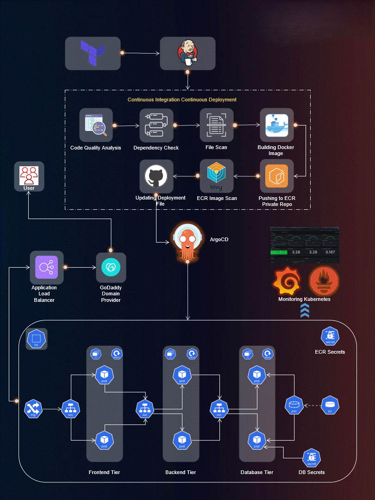

# 🚀 End-to-End DevOps Project: Three-Tier Application on AWS EKS

Welcome to the **End-to-End DevOps Project**! This repository demonstrates a complete DevOps workflow by deploying a **Three-Tier Web Application** using modern cloud-native tools and practices.

---

## 📌 Project Overview

This project showcases a scalable **three-tier architecture**:

- **Frontend**: React.js  
- **Backend**: Node.js (Express)  
- **Database**: MongoDB  

Deployed on **AWS EKS** with a fully automated CI/CD pipeline.

---

## 🛠️ Tech Stack

### ☁️ Cloud & Infrastructure
- AWS (EKS, EC2, IAM, ECR)
- Terraform

### ⚙️ CI/CD & DevOps
- Jenkins
- ArgoCD
- Docker

### 📦 Orchestration
- Kubernetes (EKS)

### 📊 Monitoring
- Prometheus
- Grafana

---

## 📁 Repository Structure

.
├── Application-Code  
│   ├── frontend  
│   └── backend  
├── Jenkins-Pipeline-Code  
├── Jenkins-Server-TF  
├── Kubernetes-Manifests  
├── assets  

---

## ⚙️ Features

- CI/CD pipeline using Jenkins  
- Dockerized applications  
- Kubernetes deployment on AWS EKS  
- GitOps with ArgoCD  
- Monitoring with Prometheus & Grafana  
- Infrastructure as Code using Terraform  

---

## 🚀 Getting Started

### 🔧 Setup Steps

#### 1. Provision Infrastructure

    cd Jenkins-Server-TF
    terraform init
    terraform apply

#### 2. Setup EKS Cluster

- Create cluster using Terraform or AWS CLI  
- Configure kubeconfig  

#### 3. Run Jenkins Pipeline

- Configure credentials  
- Trigger pipeline build  

#### 4. Deploy via ArgoCD

- Connect repo to ArgoCD  
- Sync application  

---

## 📊 Monitoring

- **Prometheus**: Collects metrics  
- **Grafana**: Visualizes performance  

### Track:
- Pod health  
- CPU & memory usage  
- Application performance  

---

## 📸 Architecture Diagram

---

## 🤝 Contributing

Contributions are welcome!

- Fork the repo  
- Create a new branch  
- Submit a pull request  

---

## 📜 License

This project is licensed under the MIT License.

---

## 👨‍💻 Author

**Srinivas Jatothu**  
GitHub: https://github.com/Srinivas-jatothu  

---

## ⭐ Support

If you like this project, give it a ⭐ on GitHub!